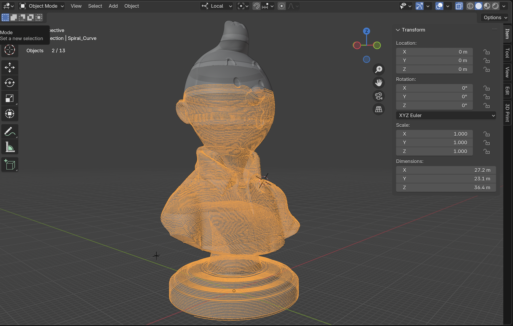

# 5 axis kinematic addon for Blender

## Functionality:

Magic spiral toolpath for single walled buste statues nad perhaps other models

## Use case:

1) Print overhanging geometry by rotating the build plate
2) Avoid using support material and avoid stringy quility for overhanging geometry

## Installation:

1) Download the addon file
2) Go to Blender > Edit > Preferences > install addon from local file > point to addon file
3) In the viewport the panel "5 - Axis printer" appears 

## Requirements:

1) Blender

